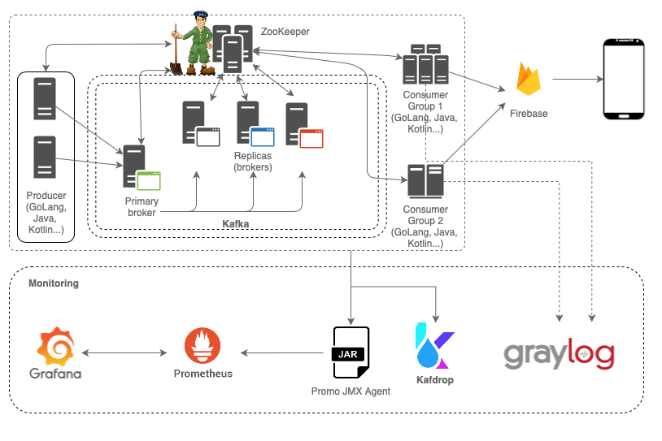

# **Mobile Push with Kafka**

This document describes the steps needed to build and run the Mobile Push Sender using Kafka.

*Updated: 30 Jan 2021*

<br/>

## Architecture

<br/>

<p align="center">
  
</p>

<br/>

## How to run the project

<br/>

All docker images can be created by docker-compose. To start all containers, use the ***docker-compose up*** command. This command will build all the necessary images and create the containers. 

Below are the hosts and ports for the all containers (docker on localhost):

* ZooKeeper - http://localhost:2181
* Kakfa - http://localhost:9092
* Kafdrop - http://localhost:19000
* Prometheus - http://localhost:9090
* Grafana - http://localhost:3000
* Graylog - http://localhost:9000

*This project needs at least 4 GB of RAM. On MacOS, docker must have 4G RAM to run all the containers in this project.
The ElasticSearch container can exit with code 137 if there is no RAM available.*

<br/>

## Developer Environment

### Tools

* Docker (https://www.docker.com/products/docker-desktop)
* Go (1.15.7 - https://golang.org/dl)
* GoLand (Optional - https://www.jetbrains.com/go/download)
* Intellij IDEA (Optional - https://www.jetbrains.com/pt-br/idea/download)
* Visual Studio Code (Optional - https://code.visualstudio.com/Download)
  - Visual Studio Code Extensions for Go
    - Go for Visual Studio Code (Microsoft - https://github.com/Microsoft/vscode-go.git)

<br/>

# GoLang Projects

***project-name = Procuder or Consumer***

## How to build the *GoLang* project

```
RUN CGO_ENABLED=0 GOOS=linux GOARCH=amd64 go build \
    -a \
    -o project-name \
    -ldflags \
    "-s -w \
     -extldflags '-static' \
     -X github.com/kenniston/mobile-push-kafka/golang/cmd.BuildTime=$(date -u '+%Y-%m-%d_%H:%M:%S%p') \
     -X github.com/kenniston/mobile-push-kafka/golang/cmd.GitCommit=$(git rev-parse HEAD) \
     -X github.com/kenniston/mobile-push-kafka/golang/cmd.Version='0.1'" main.go && \
     upx --ultra-brute -v /home/app/build/project-name && \
     upx -t /home/app/build/project-name
```

<br/>

## How to optimize the executable size

* Install UPX (Ultimate Packer for eXecutables - Compress/expand executable files)
    - MacOS X and Homebrew:
        ```
        brew install upx
        ```
    - Linux:
        ```
        apt-get install -y upx
        ```    
    -  Windows:
        ```
        choco install upx
        ```
    
* Compress the server executable with UPX:

    ```
    upx --ultra-brute -v ./project-name && upx -t ./project-name
    ```    
    or
    ```
    upx -9 -v ./project-name && upx -t ./project-name
    ```    

<br/>

## Build from Docker Container (GoLang Container)

The **docker-composer.yml** file has the build section for all GoLang project. This section uses the Dockerfile below to generate the project's executable and optimize it using the upx tool.

```
FROM golang:1.15.7-alpine as builder

RUN apk update && \
    apk add --no-cache build-base && \
    apk add --no-cache upx git ca-certificates tzdata && \
    update-ca-certificates && \
    addgroup --system app && adduser -S -G app app

WORKDIR /home/app/build
COPY . .

RUN CGO_ENABLED=0 GOOS=linux GOARCH=amd64 go build \
    -a \
    -o project-name \
    -ldflags \
    "-s -w \
     -extldflags '-static' \
     -X github.com/kenniston/mobile-push-kafka/golang/cmd.BuildTime=$(date -u '+%Y-%m-%d_%H:%M:%S%p') \
     -X github.com/kenniston/mobile-push-kafka/golang/cmd.GitCommit=$(git rev-parse HEAD) \
     -X github.com/kenniston/mobile-push-kafka/golang/cmd.Version='0.1'" main.go && \
     upx --ultra-brute -v /home/app/build/project-name && \
     upx -t /home/app/build/project-name

FROM scratch

COPY --from=builder /usr/share/zoneinfo /usr/share/zoneinfo
COPY --from=builder /etc/ssl/certs/ca-certificates.crt /etc/ssl/certs/
COPY --from=builder /etc/passwd /etc/passwd
COPY --from=builder /etc/group /etc/group

COPY --from=builder /home/app/build/project-name /home/app/project-name

USER app

ENTRYPOINT ["/home/app/project-name", "run"]
```

<br/>

## Project Command Line

*The default port can change per project*

```
./project-name run
    --server-port    [Default: 6001      - HTTP Server Port]
    --log-level      [Default: info      - (debug, error, trace, info, warning, panic, fatal)]
    --graylog        [Default: false     - Boolean]
    --graylog-ip     [Default: localhots - Graylog Server IP or host name]
    --graylog-port   [Default: 5555      - Integer]

```

<br/>

## Server Framework and Graylog Logrus Hook

The Producer project uses a server framework to expose REST endpoints (**golang/restserver** directory).
The server uses Iris Web Framework (https://github.com/kataras/iris/) to expose endpoints through project controllers.

The Logrus Graylog Hook (https://github.com/gemnasium/logrus-graylog-hook) is used to send log message through Logrus to Graylog server. The Hook is configured on the server framework:

```
var useGraylog = v.GetBool("graylog")
var graylogIP = v.GetString("graylog-ip")
var graylogPort = v.GetInt32("graylog-port")
if useGraylog {
  hook := graylog.NewGraylogHook(fmt.Sprintf("%s:%d", graylogIP, graylogPort), nil)
  logrus.AddHook(hook)
  logrus.Infof("Log messages are now sent to Graylog (udp://%s:%d)", graylogIP, graylogPort)
}
```

<br/>

# Kotlin Projects

## How to build the *Kotlin* project

*Not implemented yet*

<br/>

# Java Projects

## How to build the *Java* project

*Not implemented yet*

<br/>

# Kafka

Kafka is the message broker for this project. Services communicate with each other through Kafka topics. The project uses two topics: the first one is used to send push messages through Firebase component; the second one is used to return the results from Firebase to the caller.

<p align="center">
  
  <p align="center">Message Flow</p>
</p>

The Kafka image for this project is based on **wurstmeister/kafka:2.13-2.7.0** which provides additional parameters for Kafka containers. In addition, the final image also contains the library responsible for sending the monitoring data to prometheus (Prometheus JMX Agent).

With default setup the Kafka container starts with two topics: MobileSendPush and MobilePushResult. Each topic has 4 partition and 1 replica.

The **Kafdrop** (http://localhost:19000) can be used to manager Kafka topics. Kafdrop provides a visual Dashboard that shows Kafka information (Cluster, Brokers and Topics) and provide a visual topic editor. New topic can be created using Kafdrop, avoiding the Kafka command line tool.

<br/>

# Prometheus

## Prometheus Container

This project uses the official Prometheus container to build a new image. The new image has the config file used to link Prometheus with Kafka JXM port to receive the Kafka's metrics.

Kafka uses the Prometheus JMX Agent (port 8082 in this project) to expose Prometheus metrics through his host.

## Prometheus Architecture
<p align="center">
  
  <p align="center">https://hub.docker.com/r/prom/prometheus</p>
</p>

<br/>

# Grafana

This project uses the official Grafana container. After run the project using the ***docker-compose up*** the Prometheus's Datasource must be configured.
Use the following URL (docker on localhost) to configure the Prometheus Datasource:

<br/>

http://localhost:3000/datasources/new?utm_source=grafana_gettingstarted

*Default user:* ***admin***
<br/>
*Default password:* ***admin***

<br/>

Select Prometheus in the Time series database section:

<p align="center">
  
  <p align="center">Grafana Datasources</p>
</p>

<br/>
<br/>

Fill in the fields as the image below: 

<p align="center">
  
  <p align="center">Prometheus Datasource Info</p>
</p>

<br/>
<br/>

Last but not least, set up the Kafka Dashboard in Grafana.
Import the dashboard file from the kakfa folder (grafana-dashboard-kafka-metrics_rev4.json) using a URL below: 

<br/>

http://localhost:3000/dashboard/import

<br/>


<p align="center">
  
  <p align="center">Import the Kafka's Dashboard using the Upload JSON file button</p>
</p>

<br/>

<p align="center">
  
  <p align="center">Grafana - Kafka Dashboard</p>
</p>

<br/>
<br/>

# Graylog

This project provides a visual dashboard for logs using a Graylog container. Clients (Golang producer/consumer, Java producer/consumer and Kotlin producer/consumer) can uses GELF messages to send logs to the Graylog.

To send log messages to Graylog a new Input must be configured. To create a new Input follow the steps below:

<p align="center">
  
  <p align="center">Graylog Create Input - Step 1</p>
</p>

<br/>

<p align="center">
  
  <p align="center">Select GELF UDP and click on <b>Launch new input</b> button - Step 2</p>
</p>

<br/>

<p align="center">
  
  <p align="center">Fill in the GELF UDP Input information (title and port are the most important) and click on <b>Save</b> button - Step 2</p>
</p>

<br/>

With the input information (port and Graylog address) the clients can send log messages to the Graylog. Messages can be filtered on the **Graylog Search** tab.

<p align="center">
  
  <p align="center">Graylog Dashboard - Logs</p>
</p>

<br/>
